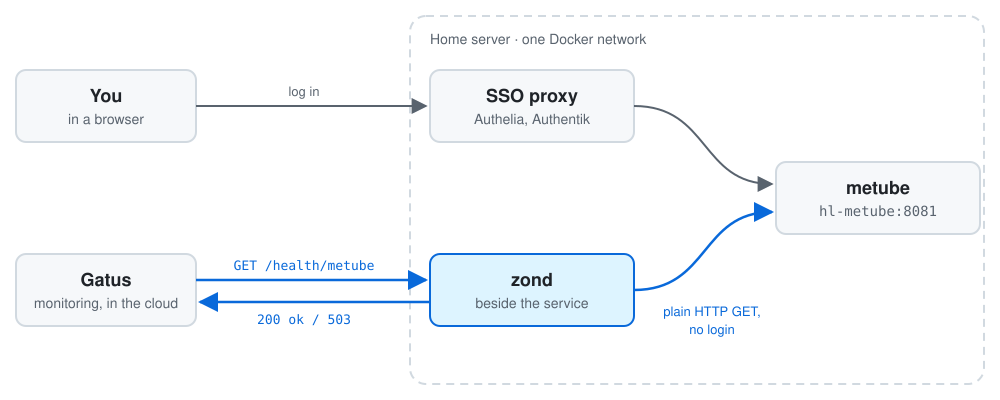

<div align="center">

# zond

**Health checks for self-hosted services behind an SSO proxy, without a
monitoring login.**

[](https://ci.antonshubin.com/repos/5)
[](https://github.com/users/spy4x/packages/container/package/zond)
[](LICENSE)

[**Running in production →**](https://probe-home.antonshubin.com) ·
[API](docs/api.md) · [Configuration](docs/configuration.md) ·
[Self-hosting](docs/self-hosting.md) · [How it works](docs/how-it-works.md)

<picture>
  <source media="(prefers-color-scheme: dark)" srcset="docs/diagram-dark.svg">
  
</picture>

</div>

Your monitor asks `https://zond.example.com/health/metube`. zond, running on the
same Docker network as metube, sends metube a plain HTTP GET and answers `200 ok`
or `503 unreachable`. The monitor never meets the login page, and zond never
tells it an internal URL. **zond** (зонд) is Russian for "probe".

Put an SSO proxy such as Authelia or Authentik in front of your services, and an
outside monitor like [Gatus](https://github.com/TwiN/gatus) sees a `302` to the
login page for every one of them. You either count that redirect as healthy or
give the monitor its own account. zond checks each service from beside it
instead. I run it on my home server; its live status is at
[probe-home.antonshubin.com](https://probe-home.antonshubin.com).

## Why zond

- **Says nothing it doesn't have to.** Answers are `ok`, `unreachable` and
  target names. No internal URLs, no response bodies, no tokens.
- **One URL per service.** `GET /health/<name>` for one target; `GET /health`
  checks them all at once and lists each by name.
- **A real HTTP check.** It sends a request and reads the status, so a service
  that listens but answers `5xx` counts as down, unlike a TCP port check.
- **Redirects are healthy.** zond never follows them: a `302` to `/login` is
  up, a `404` is not.
- **One YAML file.** Or one `ZOND_TARGETS` environment variable. Per-target
  timeouts, duplicate names rejected at startup.
- **Small and plain.** A static Go binary on the standard library plus one YAML
  parser, shipped as a distroless, non-root image.

**Use it if** an SSO proxy stands between your monitor and your self-hosted
services. **Skip it if** your monitor already runs inside that network, or you
need response times, metrics or content checks.

## Quick start

Add zond to the Compose file that runs your services, so it shares their
network:

```yaml
# compose.yml
services:
  zond:
    image: ghcr.io/spy4x/zond:latest
    restart: unless-stopped
    ports: ["8080:8080"]
    volumes: ["./zond.yml:/app/zond.yml:ro"]
```

```yaml
# zond.yml
targets:
  - name: metube
    url: http://hl-metube:8081/
```

```bash
docker compose up -d && curl http://localhost:8080/health/metube   # ok
```

Then publish zond through your reverse proxy, outside the SSO, and point your
monitor at it. More setups: [self-hosting.md](docs/self-hosting.md).

## Point your monitor at it

```yaml
# Gatus
- name: Metube
  url: "https://zond.example.com/health/metube"
  conditions:
    - "[STATUS] == 200"
```

| Request              | Answers                                                        |
| -------------------- | -------------------------------------------------------------- |
| `GET /health/<name>` | `200 ok`, `503 unreachable`, or `404` for an unknown name      |
| `GET /health`, `/`   | one `OK <name>` or `KO <name>` line each; `503` if any is down |

There is no authentication, by design: the answers carry nothing to protect.
Why, and the full contract: [how-it-works.md](docs/how-it-works.md#why-no-authentication),
[api.md](docs/api.md). Every option: [configuration.md](docs/configuration.md).

## Development

```bash
go test -race ./...
go vet ./... && gofmt -l .
```

The full command list is in [how-it-works.md](docs/how-it-works.md#development).

## Built by

I'm [Anton Shubin](https://antonshubin.com), a senior full-stack engineer and
tech lead. zond is one of the small tools I build and run on my own servers.
Need something like it built for your product?
[That's my day job →](https://antonshubin.com)

Licensed under [MIT](LICENSE). Copyright (c) 2026 Anton Shubin.

---

Made by Anton Shubin · [antonshubin.com/tools](https://antonshubin.com/tools)
